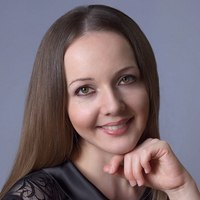

# Логопедическая студия "СЛОВОЛЁТ"

|   |   |   |   |
|---|---|---|---|
||г. Москва, | ул. Логинова, д.7, корпус 1  | |
||+7 (909) 990-86-58| +7 (916) 174-06-90 |
||[samohova.t.n@yandex.ru](mailto:samohova.t.n@yandex.ru)|   |
|   |**ЛОГОПЕД-ДЕФЕКТОЛОГ**|**НЕЙРОПСИХОЛОГ-ДЕФЕКТОЛОГ**|   |
|   |||   |
|   |Самохова Татьяна Николаевна|Аксененко Ольга Михайловна|   |

## С какими нарушениями мы работаем?

✔️ Речевые нарушения  
✔️ Аутизм  
✔️ СДВГ  
✔️ Умственная отсталость  
✔️ Задержка психического развития  
✔️ Нарушения фонематического слуха

## Наши профессиональные навыки

✔️ Умеем налаживать контакт с детьми.  
✔️ Знаем и постоянно изучаем новейшие методики коррекции нарушений речи.  
✔️ Составим индивидуальный план занятий для каждого ребёнка, учитывая особенности его физического и психического развития.  
✔️ Имеем опыт работы с детьми разного речевого уровня.  
✔️ Активно используем различные техники логопедического массажа в коррекционной работе.  

## О нас

❤️ Мастера своего дела.  
🧡 Трудолюбивые.  
💛 Без вредных привычек.  
💚 Амбициозные.  
💙 Ответственные.  
💜 Креативные.  

## Прайс-лист на услуги
|   |   |   |
|---|---|---|
|Коррекция звукопроизношения|1700|50 мин|
|Логопедический массаж|1400|35 мин|
|Подготовка к школе|1700|50 мин|
|Запуск речи с применением метода сенсорной интеграции|2200|50 мин|
|Коррекция дисграфии|1800|50 мин|